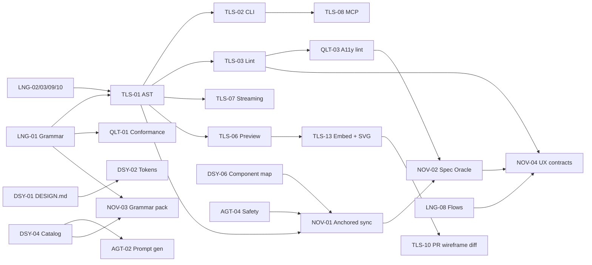

# Locked-In Feature Additions — Markdown-UI DSL v2

| | |
|---|---|
| **Status** | 🔒 **LOCKED — scope baseline v1.2** (rev. 3, 2026-10-01: +QLT-06 reference library; rev. 2: +1 feature, 1 promoted, 6 amended after source verification — see [§10](#10-change-log-rev-2)). Changes only through the [change-control process](#8-change-control). |
| **Derived from** | [`COMPETITIVE_RESEARCH.md`](COMPETITIVE_RESEARCH.md) rev. 2 (every feature cites its gap `G#` and sources `S##` there; source status codes V/V≈/C/U are defined in its §2.4) |
| **Implemented by** | [`SPEC.md`](SPEC.md) → [`PLAN.md`](PLAN.md) → [`TASKS.md`](TASKS.md) |
| **Baseline** | `markdown-ui-dsl` v1.0.3 · **Target** DSL `2.0` + toolchain `@mdui/*` 2.0 |
| **Totals** | **48 features** — 13 Language · 13 Tooling · 6 Design-system · 6 Agent · 6 Quality · **4 Novel** |

---

## 1. Design principles (non-negotiable constraints on every feature)

| # | Principle | Consequence |
|---|---|---|
| P1 | **Human-first, diffable text.** The `.ui.md` file stays the source of truth people can read and review. | No binary formats; JSON is an *output*, never the authoring format (rejects JSON-first A2UI/json-render authoring — research §6.2). |
| P2 | **Backward compatible.** Every valid v1.0.3 spec remains valid and means the same under DSL 2.0. | New syntax is additive; `dsl:` frontmatter selects behaviour; a migration tool exists but is never required. |
| P3 | **Deterministic.** Same input → same AST → same output. | No expression language in bindings (paths only); formatter is idempotent; renderers are pure. |
| P4 | **Safe by default.** Spec text is *data*, not instructions. | Blockquote hints cannot grant permissions; destructive actions require out-of-band confirmation (AGT-04). |
| P5 | **Interoperate, don't fork.** Adopt DESIGN.md, DTCG, Agent Skills, AGENTS.md, A2UI. | No private token format; exporters target existing protocols. |
| P6 | **Agent-agnostic and offline-capable.** Works with any coding agent; core toolchain needs no network or hosted LLM. | Hosted-service dependencies rejected (e.g. Thesys C1). |
| P7 | **Verifiable.** Every claim a spec makes should be checkable by a tool. | Drives lint, conformance suite, Oracle, constraints. |
| P8 | **Progressive disclosure for agents.** The skill an agent loads stays small; depth lives in referenced files. | Agent Skills layout (AGT-01); prompt generator emits only what the project needs. |

---

## 2. Priority and release key

**MoSCoW:** **M** Must · **S** Should · **C** Could. Sizing and effort live in [`TASKS.md`](TASKS.md) / [`PLAN.md` §9](PLAN.md#9-estimates).

| Release | Contents (summary) | Gate |
|---|---|---|
| **2.0.0-alpha** | Grammar, AST, CLI core, structural lint, conformance suite, repo fixes | Phase 1 checkpoint |
| **2.0.0-beta** | v2 syntax, tokens/DESIGN.md, catalog, formatter/diff/preview/streaming, skill restructure, prompt gen, safety, a11y lint, evals | Phase 2+3 checkpoints |
| **2.0.0 GA** | MCP server, A2UI/json-render exporters, SDD interop, **all four novel features**, docs site | Phase 4 checkpoint |
| **2.1** | VS Code ext., GitHub Action, importers, remaining exporters, runtime renderer, Flutter oracle, i18n | Phase 5 checkpoint |

---

## 3. Feature register

### 3.1 Language (LNG)

| ID | Feature — what is locked | Pri | Rel | Gap / evidence |
|---|---|:-:|:-:|---|
| **LNG-01** | **Formal grammar & normative spec.** EBNF/PEG grammar for the full DSL (v1 surface first, then v2), published as the single normative reference; `SKILL.md` becomes a derived summary. | M | α | G1; B-01, B-03; [S09][S20][S38] |
| **LNG-02** | **Typed closers + inline attributes.** Optional typed closers (`--- END COLUMN ---`); generic `--- END ---` still valid. Inline attribute list `{: #id .class key=value flag }` on any component or block opener (distinct delimiter, so it never collides with dropdown `{A, B}` options or `{{ }}` bindings). | M | α | G1, G15; B-03; [S01][S10] |
| **LNG-03** | **Field attributes & validation hints.** `required`, `type=email\|password\|number\|date\|tel\|url`, `min`, `max`, `pattern`, `maxlength`, `readonly`, `disabled`, `autocomplete`, `label=`, `hint=`, `error=`. | M | α | G15; [S01] |
| **LNG-04** | **Expanded primitives.** `GRID`, `ACCORDION`, `DRAWER`, `TOAST`, `TOOLTIP`, `STEPPER`, `BREADCRUMBS`, `PAGER`, `PROGRESS`, `SLIDER`, `DATE`, `FILE`, `AVATAR`, `ICON` (named icon set), `SKELETON`, `CHART` (line/bar/pie/scatter), `STAT`, `CALLOUT`, `CODE`, `EMPTY STATE`; **rev. 2 adds `TREE` (+ tree-table), `GROUP` (titled group box), `MENUBAR`, a `scroll` attribute (`x\|y\|both`) and labelled dividers** — all seen in PlantUML Salt. | S | β | G14, G28; [S06][S04][S01][S12] |
| **LNG-05** | **UI states.** `::: REGION name :::` containing `::: STATE default\|loading\|empty\|error\|disabled\|… :::` alternatives, so loading/empty/error designs are first-class. | S | β | G11; [S72][S51] |
| **LNG-06** | **Data model & binding (paths only).** Frontmatter `data:` (inline shape, JSON/YAML file, or JSON Schema); `{{ user.name }}` references; `::: EACH item in items :::`; `::: IF flag :::` (boolean path or `!path` only). Binding paths are validated against the model. | S | β | G10; B-06; [S20][S38][S44] |
| **LNG-07** | **Partials / includes.** `[[ USE: ./partials/nav.ui.md ]]` with optional `{props}`; cycle detection; path-sandboxed to the project root. *(Salt's `!procedure` macros show the same reuse need.)* | S | β | G13; [S11][S53][S12] |
| **LNG-08** | **Flow files.** `*.flow.md` declares screens (links to `.ui.md`), start screen, and transitions `from#action -> to [when: …]`; yields a navigation graph. | S | β | G12; [S58][S80][S53] |
| **LNG-09** | **Escaping & collision rules.** Backslash escapes; fenced code is literal; precedence rules for `[ ]` checkbox vs link vs input; `---` fence vs closer disambiguated by position. | M | α | G1; B-03, B-06 |
| **LNG-10** | **Language versioning & migration.** `dsl: 2.0` frontmatter key; unversioned files are treated as `1.x`; `mdui migrate` applies safe rewrites and reports manual items. | M | α | G1; B-08; [S20][S27] |
| **LNG-11** | **Action intent registry.** Optional frontmatter `actions:` declaring each `#action` target's *intent* (verb, effect description, confirmation needed, destructive flag) — descriptive only, no handlers. | S | β | G10; [S43][S20] |
| **LNG-12** | **i18n / RTL hints.** `lang:`/`dir:` frontmatter; optional `t("key")` text references with a keys file; long-string layout hint. *(No competitor evidence — first-principles; kept light.)* | C | 2.1 | G24 |
| **LNG-13** | **Environment directives.** Reuse the `> @…` directive family for `@dark`, `@light`, `@print`, `@reduced-motion`, `@contrast-more`, `@touch`, `@hover` besides breakpoints. | S | β | G23; [S27][S60] |

### 3.2 Tooling (TLS)

| ID | Feature — what is locked | Pri | Rel | Gap / evidence |
|---|---|:-:|:-:|---|
| **TLS-01** | **Reference parser → JSON AST + JSON Schema.** Typed AST with source spans, versioned schema; published as `@mdui/core` and `@mdui/spec`. | M | α | G2; [S01][S06][S08] |
| **TLS-02** | **`mdui` CLI.** Commands: `validate`, `lint`, `fmt`, `ast`, `render`, `export`, `diff`, `migrate`, `prompt`, `grammar`, `sync`, `verify`, `stats`; `--json` output and stable exit codes. | M | α | G3; [S54][S01] |
| **TLS-03** | **Lint engine + rule catalog.** Rule API, severities (error/warn/info), config file, inline `<!-- mdui-disable rule -->`; ≥ 30 rules across structure, a11y, tokens, catalog, flows. | M | α | G3; [S09][S54] |
| **TLS-04** | **Canonical formatter.** `mdui fmt` — idempotent, comment-preserving, stable attribute ordering. | S | β | G3 |
| **TLS-05** | **Semantic diff.** `mdui diff a b` reports added/removed/moved/changed nodes and token deltas; non-zero exit on regressions. | S | β | G3; [S54][S86] |
| **TLS-06** | **HTML preview.** Static render + `--watch` live-reload server; styles `sketch`, `clean`, `wireframe`, `none`; viewport/dark/state toggles; **rev. 2: `--scale`/`--dpi` zoom and a handwritten-sketch option (Salt parity)**. | S | β | G4, G28; [S01][S51][S12] |
| **TLS-07** | **Streaming incremental parser.** Chunk-fed parser emitting partial AST; guarantee: streamed result equals batch result. | S | β | G5; [S06][S38][S27] |
| **TLS-08** | **MCP server `@mdui/mcp`.** Tools: `parse`, `validate`, `lint`, `fmt`, `diff`, `render`, `prompt`, `catalog`, `sync_plan`, `verify`. | S | GA | G16; [S65][S72][S69] |
| **TLS-09** | **VS Code extension + language server.** TextMate grammar, diagnostics from lint, preview pane, quick-fixes. | S | 2.1 | G4; [S01][S51] |
| **TLS-10** | **GitHub Action.** Runs validate/lint/verify; posts a **wireframe diff** comment on PRs that touch `.ui.md`. | S | 2.1 | G4; [S73][S17] |
| **TLS-11** | **Importers.** Figma → DSL (via Figma MCP) and HTML → DSL (best effort, lossy by design, always flagged). | C | 2.1 | G25; [S65][S70] |
| **TLS-12** | **Token benchmark & stats (promoted C→S, GA).** `mdui stats` plus a published benchmark: the *same* UI scenarios authored as mdui, A2UI JSON, A2UI *Express*, json-render JSON and OpenUI Lang, counted with a **named tokenizer**, with methodology and raw data; results published **whatever they show**. | S | GA | G27; [S115][S114][S38] |
| **TLS-13** | **Embeddable fence & SVG renderer (new).** A ```` ```mdui ```` fence; `remark`/`markdown-it`/`rehype`/Obsidian adapters; **SVG output that displays inside GitHub/Notion/static sites**; *(2.1)* flow-diagram rendering with embedded screen previews, as Salt does inside activity diagrams. | S | GA (fence+SVG) · 2.1 (flow diagrams) | G26; B-09; [S117][S116][S140][S12] |

### 3.3 Design system & tokens (DSY)

| ID | Feature — what is locked | Pri | Rel | Gap / evidence |
|---|---|:-:|:-:|---|
| **DSY-01** | **DESIGN.md as first-class theme.** `theme:` accepts a Google-format `DESIGN.md` (YAML tokens + prose sections) and the legacy prose design-system files; mdui adds only a `mdui:` extension block (breakpoints, framework mappings). | M | β | G8; [S54] |
| **DSY-02** | **Token references & exporters.** `{colors.primary}` references resolved; export to Tailwind v3/v4, CSS custom properties, and DTCG. Style Dictionary is used **only if its DTCG support is confirmed** (not stated in its README — verify at T-038); otherwise a native DTCG exporter. | S | β | G8; [S54][S60][S63][S141] |
| **DSY-03** | **Token lint.** Broken refs (error), WCAG AA contrast on declared component pairs, orphaned tokens, unknown breakpoint keys. | S | β | G8, G9; [S54][S95] |
| **DSY-04** | **Component catalog + trust levels.** `mdui.catalog.yaml` lists built-in primitives and project components with prop schemas and a trust level (`core`, `project`, `third-party`); unknown components fail lint. | M | β | G6; [S20][S24][S38] |
| **DSY-05** | **More design-system examples.** React + shadcn (DESIGN.md-based), SwiftUI, Jetpack Compose, Vue/Nuxt, Angular Material, Lit (≥ 4 new). | S | GA | G8; [S76][S58] |
| **DSY-06** | **Component map.** `mdui.map.yaml` maps DSL primitives/catalog items to code components, import paths and prop mappings (Code-Connect-style [S129]); optional autopopulation from Storybook manifests — **the Storybook MCP repo has moved into the main Storybook repo, so the integration targets the manifests, not the archived MCP package** [S130]. | S | GA | G6, G30; [S65][S72][S77][S129][S130] |

### 3.4 Agent integration (AGT)

| ID | Feature — what is locked | Pri | Rel | Gap / evidence |
|---|---|:-:|:-:|---|
| **AGT-01** | **Agent Skills restructure + AGENTS.md.** `skills/markdown-ui-dsl/` follows the Agent Skills layout with the **verified limits**: `SKILL.md` ≤ 500 lines, body < 5,000 tokens recommended, `name` ≤ 64 chars, `description` ≤ 1,024, `compatibility` ≤ 500, references one level deep, validated with `skills-ref validate` [S131]; add contributor `AGENTS.md`. Wireloom already ships a skill + `AGENTS.md` [S116]. | M | β | G19; [S89][S131][S90] |
| **AGT-02** | **Prompt generator.** `mdui prompt` emits the minimal system prompt for *this project* from catalog + tokens + data model + few-shot examples. | M | β | G7; [S38][S06] |
| **AGT-03** | **SDD interoperability.** `requirements:` frontmatter linking EARS requirement IDs; coverage lint ("requirement has no screen"); templates for Spec Kit, OpenSpec and Kiro flows. | S | GA | G21; [S81][S84][S86] |
| **AGT-04** | **Safety hardening.** Spec text and hints are untrusted data; hints cannot disable confirmation; `force`/`autonomous` is a *tool parameter*, not magic words; URL scheme allow-list; lint for hints that look like instructions. | M | β | G20; B-04; [S20][S27] |
| **AGT-05** | **Protocol exporters.** **S:** A2UI JSON targeting the **v1.0 message set** (`createSurface`, `updateComponents`, `updateDataModel`, …), pinned to a spec commit because the spec README still says "candidate for stable" [S112][S113]; json-render spec. **C:** A2UI *Express* text, Adaptive Cards, Slack Block Kit, Open-JSON-UI. | S/C | GA / 2.1 | G22, G29; [S20][S112][S114][S38][S43][S51][S37] |
| **AGT-06** | **Runtime generative-UI mode.** React renderer package that renders streamed DSL against a catalog with host-owned components (A2UI-style trust model). | C | 2.1 | G5, G6; [S20][S27][S06] |

### 3.5 Quality & governance (QLT)

| ID | Feature — what is locked | Pri | Rel | Gap / evidence |
|---|---|:-:|:-:|---|
| **QLT-01** | **Conformance suite.** Language-neutral fixtures (valid/invalid + expected AST/diagnostics) so third-party parsers can claim conformance. | M | α | G18; B-07; [S01] |
| **QLT-02** | **LLM eval harness.** **Tool-agnostic**: assertions are `mdui validate`/`lint` runs; promptfoo [S109] is *one* runner (the repo states it is now OpenAI-owned [S136]); deterministic AST assertions first, rubric second; CI thresholds; ≥ 3 agents. | M | β | G18, G30; B-03, B-07; [S109][S136] |
| **QLT-03** | **Accessibility semantics & lint.** `label`, `alt`, `role`, `live`, landmark roles from HEADER/FOOTER, heading-order, link-text, target-size annotations; WCAG 2.2 mapping table. | M | β | G9; [S95][S105][S107] |
| **QLT-04** | **Repository hygiene.** Fix B-01 (4 unbalanced examples), B-02 (dead references), B-06 (prose abuse in example), duplicate README numbering; add CI that lints all examples. | M | α | B-01, B-02, B-06 |
| **QLT-05** | **Governance & docs.** RFC process, CHANGELOG, CONTRIBUTING, versioning policy, docs site with in-browser playground. | S | GA | G1 |
| **QLT-06** | **Reference library & provenance (rev. 3).** `reference/` holds 32 pinned, shallow upstream repos as submodules (A2UI, json-render, Markdoc, wiremd, Wiremark, Wireloom, OpenUI, DESIGN.md, DTCG, llguidance, XGrammar, axe-core, Playwright ARIA engine, …); `scripts/reference.sh` searches, checks licences and **lifts** code with automatic provenance logging in `THIRD_PARTY_NOTICES.md`; a generated manifest maps every repo to what to lift and which tasks use it; CI keeps `reference/` out of builds/lint and `packages/` free of imports from it. Rule: **find → licence-check → lift → improve → log** ([`reference/README.md`](../reference/README.md)). | M | α | efficiency; B-07; reuse of verified prior art [S20][S38][S06][S01][S132] |

---

## 4. Feature dependency overview



---

## 5. Novel / breakthrough features

Each novel feature has: the problem, the mechanism, an example, a **falsifiable success metric** (so the novelty claim is testable, not rhetorical), risks, and nearest prior art (from [research §8](COMPETITIVE_RESEARCH.md#8-novelty-analysis)). Thresholds below are **proposed targets**, not measured results.

### NOV-01 — Anchored Three-Way Sync (`.ui.lock`)

**Problem.** v1 sync is prose: the agent reads two files, guesses what drifted, and "asks the user which file is the source of truth" (`SKILL.md` L63–67; B-05). That is whole-file, two-way, and non-deterministic. Real teams edit *both* sides.

**Mechanism.**
1. **Anchors.** Each *sync unit* (`CARD`, `MODAL`, `HEADER`, `FOOTER`, `REGION`, `FORM`, any node with `{: #id }`) gets a stable anchor — explicit (`{: #checkout-form }`) or lock-assigned (`~a7f2`) and maintained across edits by tree matching, so the spec stays clean.
2. **Code carries anchors** at sync-unit roots — a comment (`// ui:anchor checkout-form`) and, for web/Flutter, a runtime attribute/identifier (`data-mdui-anchor`) that Spec Oracle (NOV-02) reuses.
3. **`.ui.lock`** (JSON, committed): `dsl` version, spec content hash, normalised AST snapshot at last sync, anchor → {spec path, code path, code semantic fingerprint}.
4. **Three-way classification per anchor** — *base* (lock) vs *spec* (now) vs *code* (now):

| base→spec | base→code | Class | Action proposed |
|---|---|---|---|
| unchanged | unchanged | `clean` | none |
| changed | unchanged | `spec-ahead` | plan **spec→code** patch |
| unchanged | changed | `code-ahead` | plan **code→spec** patch |
| changed | changed, equivalent | `converged` | update lock only |
| changed | changed, different | `conflict` | explain per-node, require explicit choice or hand merge |
| present | no anchor in code | `orphan-spec` | propose generating the unit |
| absent | anchor in code, not in spec | `orphan-code` | propose adding to spec or marking code-only |

5. **`mdui sync plan`** (read-only, human + JSON output) → **`mdui sync apply`**, which requires an out-of-band confirmation parameter (ties to AGT-04; "force" is never read from spec text). Apply is atomic and re-extracts afterwards; lock updates only if re-extraction matches the intended result.

```text
$ mdui sync plan wireframes/login-form.ui.md
login-form      spec-ahead   + [ Login with Google ](#google) under #login      → src/components/LoginForm.tsx
remember-me     code-ahead   + "Keep me signed in" label text changed          ← src/components/LoginForm.tsx
help-link       conflict     spec: "Need help?"  code: "Contact support"        ⚠ choose
```

**Success metrics (targets).** (a) ≥ 95% correct class on a ≥ 200-case generated fixture set (mutations applied to spec, code or both); (b) **zero** data-loss in apply: property test "apply then re-extract equals intended state" over ≥ 1,000 generated cases; (c) agent turns that ask "which is the source of truth?" occur **only** for `conflict`/`orphan-*`; (d) adapters: TSX + HTML at GA, Dart/Razor at 2.1.

**Risks.** Static code extraction is brittle → extraction uses *semantic summaries* (labels, roles, order, actions) and prefers the rendered accessibility tree (shared with NOV-02) over source parsing where available. Anchor churn → tree matching with similarity threshold and a `mdui sync relink` escape hatch.

**Prior art (rev. 2).** The *technique* is established: UML **round-trip engineering** (Papyrus, Visual Paradigm) synchronises model and code bidirectionally with incremental merge [S148], and VCS **three-way merge** uses a common ancestor [S149]; in AI-spec tooling, Tessl detects spec-level drift [S87], Code Connect maps components [S129], OpenSpec tracks requirement deltas [S86]. **What remains new:** applying it to a **Markdown wireframe ↔ framework code** at **layout-node** granularity, with a committed lockfile and an **agent hand-off protocol**. *Judged by the sources reviewed; we claim the application, not the algorithm.*

### NOV-02 — Spec Oracle (accessibility-tree conformance with a Fidelity Score)

**Problem.** After an agent generates code from `login-form.ui.md`, how do you *know* it matches? Today: eyeball it, or pixel-diff (wrong tool for a lo-fi spec), or run axe (checks generic rules, not *this spec*) [S93]. Research shows LLM-generated UI frequently has semantic/accessibility defects [S105][S107].

**Mechanism.**
1. **Compile** the AST to an *expected accessibility tree* using a fixed DSL→ARIA mapping (e.g. `[ Login ](#login)` → `button "Login"`, `[ text: Email ]{label="Email"}` → `textbox "Email"`, `HEADER` → `banner`, `MODAL` → `dialog`, `|[ A ]| B |` → `tablist`/`tab`, tables → `table/row/cell`), per **state** (LNG-05), **breakpoint** and **theme** (LNG-13).
2. **Run** against the live app: Playwright accessibility snapshot of the page/region for web [S96][S97]; Flutter `SemanticsController` for Flutter [S98][S99] (2.1).
3. **Match** in `subset` mode by default (extra elements allowed; order enforced where the spec's order is significant); `strict` mode optional.
4. **Report** per-node verdicts — `present`, `missing`, `role-mismatch`, `name-mismatch`, `order-mismatch`, `extra` — **mapped to spec file:line and anchor** (NOV-01), plus a **Fidelity Score** = Σ(weight × matched) / Σ(weight × expected), weights: interactive 3, heading 2, landmark 2, text 1 (configurable). JSON + Markdown report; CI threshold (`--min-fidelity 0.95`).

```text
$ mdui verify wireframes/login-form.ui.md --url http://localhost:3000/login
login-form.ui.md  fidelity 0.92  (24/26 expected nodes)
  ✖ L14  [ Forgot Password? ](#forgot-password)  missing   (expected link "Forgot Password?")
  ✖ L9   [ text: Password ]{type=password}       name-mismatch (expected "Password", got "")
```

**Why it is transcendental.** It turns the wireframe from *advice* into an *executable acceptance test*, framework-neutral and pixel-free, and it double-checks accessibility because the oracle *is* the accessibility tree.

**Success metrics (targets).** On a golden set of ≥ 10 apps × ≥ 20 seeded code mutations each (delete element, rename label, change heading level, swap role, reorder): **recall ≥ 90%** on seeded semantic mutations, **false-positive ≤ 5%** on semantically-equivalent refactors (restyle, component extraction, wrapper divs); report generation ≤ 5 s per screen.

**Risks.** Accessible-name inference differences between browsers → pin Chromium for CI, allow `name-match: loose`. Placeholder vs label ambiguity in `[ text: … ]` → require/lint `label=` (LNG-03) and document the fallback. Dynamic data → fixtures from the `data:` model.

**Prior art (rev. 2).** Playwright ARIA snapshots are hand-written, **order-sensitive** and support partial matching [S132]; axe is a rule engine ("zero false positives", ~57% of WCAG issues) [S93]; **Design2Code** scores generated front-ends against a *reference render* (CLIP + block/text/position) and **WebAccessBench** measures WCAG conformance of generated UIs [S144][S145]; Chromatic is pixel-based [S73]; Flutter `meetsGuideline` is rule-based [S98]. **What remains new:** no surveyed system *derives the expected semantic tree from a wireframe spec*. **Design consequence of the verified matching rules:** because Playwright's native comparison is order-sensitive, mdui ships its **own matcher** (needed for order-insensitive regions such as `ROW` groups) *and* emits Playwright-compatible YAML templates for teams that want hand-runnable tests.

### NOV-03 — Valid-by-Construction Grammar Pack

**Problem.** An LLM can emit a `.ui.md` with unbalanced blocks, unknown components or dangling token refs (B-01 shows even the maintainers' examples do). Prompting reduces but cannot eliminate this.

**Mechanism.** `mdui grammar --target lark|gbnf|json-schema [--catalog …] [--tokens …] [--data …] [--max-depth N]` emits a grammar for a **constrained-decoding engine** — OpenAI custom-tool CFG (Lark) [S102], llguidance [S100], XGrammar [S101], llama.cpp GBNF — such that the model **cannot** emit:
- unbalanced or mismatched container nesting (typed closers make this a pure CFG property);
- components outside the **project catalog** (DSY-04);
- `{token.refs}` outside the declared tokens, `{{ data.paths }}` outside the data model;
- unsupported directives/breakpoints.

A **parity guarantee** ties grammar and parser together: every string the grammar accepts parses with zero errors; every valid conformance fixture is accepted (QLT-01). Dynamic specialisation of grammars from runtime context follows the decode-time-grammar line of research [S103].

**Success metrics (targets).** (a) Grammar↔parser parity on ≥ 100k fuzz-generated strings and 100% of valid fixtures; (b) structural validity of constrained output **100% on engines with exact grammar enforcement** (local: llguidance, XGrammar, llama.cpp) vs a **measured** unconstrained baseline per model (T-061 reports it — we do not assume it); for **hosted APIs** the rate is *measured and reported, not promised* (a community thread reports hosted Lark outputs not always conforming [S152, title only]), and the toolchain **always re-validates with the reference parser**; (c) semantic-quality delta of constrained vs unconstrained measured with the QLT-02 rubric and published (constrained decoding can affect quality [S104]).

**Risks / honesty.** Availability depends on the serving stack (CFG-capable APIs or local engines); this research did **not** verify CFG support on every hosted model, so the pack ships three targets and documents the capability matrix at release. Lark dialect differences between engines → per-engine emitters and tests.

**Prior art (rev. 2).** **A2UI ships `Express.g4`, an ANTLR grammar for a compact UI DSL** [S114]; OpenUI Lang is a line-oriented DSL with typed component contracts [S115]; json-render/A2UI constrain *JSON* via schemas [S38][S20]; OpenAI custom tools accept Lark/regex grammars (verified in the cookbook) [S135]; XGrammar and llguidance make CFG decoding fast [S134][S100]. **What remains new:** none of the surveyed projects documents a decoding grammar for a **Markdown** wireframe DSL, **specialised per project catalog** and **parity-tested against the parser**, nor use of Express/OpenUI grammars for constrained decoding. *T-061 includes a comparison deliverable against `Express.g4` on equivalent UIs.*

### NOV-04 — UX Constraint Contracts

**Problem.** Wireframes are where UX mistakes are cheapest to fix, yet nothing checks them. Heuristics (Nielsen [S108]) live in slide decks; linters work on tokens (DESIGN.md contrast [S54]) or finished DOM (axe [S93]).

**Mechanism.** Declare contracts in frontmatter (project-wide), per screen, or per region with `> constraint: …`; evaluate on the AST **and flow graph** (LNG-08) before any code exists, then re-verify the measurable subset after code via NOV-02.

```yaml
constraints:
  max-primary-actions: 1            # per screen region
  form-fields: { max: 7 }
  flow-depth: { max: 3 }            # from start screen to any goal
  destructive-needs-confirm: true   # {destructive} actions must reach a MODAL or declare undo
  no-dead-ends: true                # every non-terminal screen has an outbound transition
  every-input-labelled: true
  tap-target: { min: 44 }           # px; verified post-code via bounding boxes
  heading-order: strict
  states-required: [loading, empty, error]   # for data-bound regions
```

**Rule catalogue (≥ 12 at GA), each mapped to a heuristic:** max-primary-actions (consistency/visibility), form-fields (recognition vs recall / minimalism), flow-depth & back-path-exists (user control & freedom), destructive-needs-confirm (error prevention), no-dead-ends (user control), states-required (visibility of system status), error-recovery-message (diagnose & recover), every-input-labelled / heading-order / tap-target (accessibility, WCAG 2.2 target size [S95]), unique-primary-per-modal, max-nav-items, help-reachable.
**Waivers** are explicit and auditable: `waive: <rule> reason="…"` recorded in the lock.

**Success metrics (targets).** ≥ 12 rules, each with pass/fail fixtures; on a ≥ 20-spec seeded-violation set **recall ≥ 95%** and **0 false positives** on the clean set; ≥ 4 rules verifiable post-code through NOV-02.

**Risks.** Heuristic thresholds are *configurable defaults*, not universal usability truth — documentation states that; rules ship `warn` by default except accessibility rules.

**Prior art (rev. 2).** DESIGN.md token lint [S54]; axe DOM rules [S93]; Nielsen as guidance [S108]; **Kiro turns requirements into executable properties checked by property-based testing** [S137] — the nearest *executable-spec* analogue, but requirements-level, not UI-level. **What remains new:** no surveyed system executes **flow-level UX heuristics on a lo-fi spec** before code exists; Wiremark/Salt model flows but document no constraints on them [S117][S12].

---

## 6. How the novel features compound

```
 spec ──► NOV-03 grammar pack ──► agent emits VALID spec (by construction)
  │                                     │
  │                         NOV-04 constraints lint the spec + flow graph (pre-code)
  ▼                                     │
 agent generates code ◄─────────────────┘
  │   (anchors written: NOV-01)
  ▼
 NOV-02 Oracle: compiled expected a11y tree vs live app ──► Fidelity Score + NOV-04 post-code checks
  │
  ▼
 NOV-01 three-way sync keeps spec ⇄ code honest as both evolve (.ui.lock)
```

Together they close the loop: **constrain → generate → check → keep in sync**, all deterministic and offline-capable.

---

## 7. Explicit non-goals (locked out of scope)

| Non-goal | Reason |
|---|---|
| A hosted service, account system or telemetry | P6 (offline, agent-agnostic). |
| High-fidelity visual design / pixel-perfect theming | Stays a spec layer; partner via exporters/importers. |
| A general-purpose expression language in specs | P3/P4. |
| Executable HTML/JS inside specs | P4. |
| Replacing DESIGN.md, DTCG, A2UI, Agent Skills | P5 — adopt, don't fork. |
| Authoring in JSON | P1 — JSON is an output. |
| Guaranteeing "good UX" | NOV-04 enforces declared constraints; it does not define quality. |
| Winning a raw token-count race at the expense of human readability | OpenUI Lang/A2UI Express are machine-first [S115][S114]; mdui is human-first (P1). We **measure and publish** (TLS-12) and may add a compact *profile*, but never contort the authoring syntax for tokens. |

---

## 8. Change control

1. **Adding** a feature: open an RFC (`docs/rfcs/NNNN-title.md`, created by T-004) that cites a gap with **evidence** (add or reuse a `[S##]` in `COMPETITIVE_RESEARCH.md`), states the principle(s) it serves, and sizes it.
2. **Removing/deferring**: RFC with the reason; record in §7 or move the release column.
3. **Changing a metric/threshold** in §5: allowed only with measured data from the relevant eval (T-061 for NOV-03, T-074 for NOV-01, T-077 for NOV-02, T-079 for NOV-04, T-063 for evals), recorded in the RFC.
4. The feature register in §3 and [`TASKS.md`](TASKS.md) must be updated in the **same** PR as the RFC.
5. Novelty claims are re-checked against the research method at each minor release; if a competitor ships an equivalent, update `COMPETITIVE_RESEARCH.md` §8 and keep or re-scope the feature on its merits.

---

## 9. Feature → task traceability

Every feature ID above appears in the `Implements` column of [`TASKS.md`](TASKS.md); the plan's checkpoint on traceability (PLAN §7) requires 100% coverage before each release.


---

## 10. Change log (rev. 2)

Driven by the verification pass in [`COMPETITIVE_RESEARCH.md` §2.4](COMPETITIVE_RESEARCH.md#24-verification-pass-rev-2-same-day). Processed under §8 (rev. 2 is the maintainers' own re-baseline of v1; no RFC required for the baseline itself, but each item below is traced to evidence).

| Change | Type | Evidence |
|---|---|---|
| **TLS-13** Embeddable fence & SVG renderer | **Added** | Wiremark/Wireloom/Mermaid embed via fence/SVG [S117][S116][S140]; B-09 |
| **TLS-12** Token benchmark | **Promoted** C→S, 2.1→GA; scope widened | OpenUI Lang published −52.8% vs JSON [S115]; A2UI Express [S114]; B-10 |
| **LNG-04** primitives | Amended (+TREE, GROUP, MENUBAR, scroll, labelled dividers) | Salt capture [S12] |
| **LNG-07**, **TLS-06** | Amended (macro-reuse evidence; `--scale/--dpi`, sketch option) | Salt capture [S12] |
| **AGT-05** exporters | Amended: A2UI **v1.0** message set, Express as Could | A2UI protocol doc [S112][S114] |
| **AGT-01** skill | Amended with verified limits | Agent Skills spec [S131] |
| **QLT-02** harness | Amended: tool-agnostic | promptfoo ownership [S136] |
| **DSY-02**, **DSY-06** | Amended: Style Dictionary/DTCG unconfirmed; Storybook MCP moved | [S63][S130] |
| **NOV-01…04** prior-art and metrics | **Re-scoped** (claims narrowed, one metric tempered, one design consequence added) | §5 above |
| LNG-08 flows | Re-justified: parity-plus, not unique | Wiremark named frames [S117]; Salt activity embedding [S12] |

### Competitive response map

| Competitor move (verified) | Our response |
|---|---|
| OpenUI Lang: compact streaming DSL, −52.8% tokens vs JSON [S115] | Measure ourselves (TLS-12, spike SP-4); stay human-first; streaming parser (TLS-07); possible compact profile decided on data |
| A2UI v1.0 + Express text DSL [S112][S114] | Pin exporters to v1.0; Express exporter (Could); position mdui as the *human-authored source* that compiles to both |
| Wiremark / Wireloom: fence + SVG in GitHub/Obsidian [S117][S116] | TLS-13 (fence, plugins, SVG) → TLS-10 PR wireframe diffs |
| Wireloom: skill + AGENTS.md; zero-dep core [S116] | AGT-01; zero-dependency `@mdui/core` already mandated |
| Salt: breadth of widgets and screens-in-flow [S12] | LNG-04 additions; flow-diagram render (2.1); real token theming where Salt's is partial |
| Claude Design / Superdesign / Onlook: agent-native design→code loops [S146][S147][S157] | Vendor-neutral, diffable spec + verification (NOV-01/02) — the part a closed canvas does not provide |
| Tooling churn: promptfoo → OpenAI; Storybook MCP moved; AI SDK RSC paused [S136][S130][S50] | Tool-agnostic harness; adapters behind pinned interfaces; no dependency on archived packages |

### Rev. 3 (reference library)

| Change | Type | Evidence |
|---|---|---|
| **QLT-06** Reference library & provenance | **Added** (Must, α) | Owner request to avoid re-creating existing code; 32 verified upstream repos on disk; A2UI ships a conformance suite and eval harness, Playwright ships the ARIA engine, json-render/OpenUI/mdocUI ship streaming parsers [S20][S132][S38][S115][S06] |
| Effect on estimates | Plan | Lifting is expected to cut build effort for T-015/T-042/T-063/T-076/T-077/T-090 — **not yet quantified**; T-044-style measurement of actual lift savings is recorded in PR descriptions ("improvement made") and reviewed at checkpoints |
