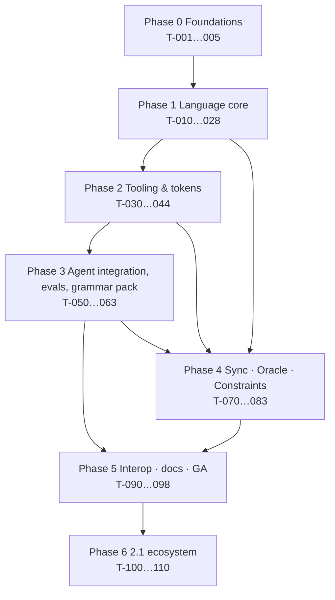

# Implementation Plan — Markdown-UI DSL v2 Program

| | |
|---|---|
| **Status** | Draft for maintainer sign-off · prepared 2026-10-01 |
| **Implements** | [`FEATURE_ADDITIONS.md`](FEATURE_ADDITIONS.md) (47 features) per [`SPEC.md`](SPEC.md) |
| **Work items** | [`TASKS.md`](TASKS.md) — 83 tasks, 7 phases · **rev. 2** (source-verification pass: +3 tasks, −1, 14 amended; spike SP-4 added) |
| **Method** | Planning & task breakdown: read-only analysis → dependency graph → vertical slices → small verifiable tasks → checkpoints between phases |

---

## 1. Planning principles

1. **Vertical slices, not layers.** Every phase ends with something a user can run end-to-end (e.g. after Phase 1: `mdui validate|lint` on real specs), never "the parser is done but nothing uses it".
2. **Dependency-first.** The grammar → parser → AST spine gates everything; it is scheduled first and kept on the critical path (§4).
3. **Riskiest assumption earliest.** Four time-boxed **spikes** (§5) de-risk the novel features and the token-efficiency question before the syntax freezes or Phase 4 commits.
4. **Small tasks.** `S`/`M` preferred; every `L` is split at the start of its phase (TASKS gives the split). Each task has *Done when* and *Verify*, so an agent or human can pick one up cold.
5. **Checkpoints between phases** with measurable gates (§7). No phase starts on a red checkpoint.
6. **Compatibility is a gate, not a hope.** The v1 compatibility test (T-024) is release-blocking from Phase 1 onward.
7. **Scope is locked; schedule flexes.** If capacity falls short, slip the release train (§8), do not silently drop features — use FEATURE_ADDITIONS §8 change control.

---

## 2. Target architecture

```
                  .ui.md / .flow.md                         DESIGN.md · DTCG · mdui.catalog.yaml · mdui.map.yaml · data
                         │                                                         │
                         ▼                                                         ▼
   ┌─────────────────────────────────────────────────────────────────────────────────────┐
   │ @mdui/core  (zero deps, no Node APIs, browser-safe)                                  │
   │  line classifier → block parser → inline parser → frontmatter → directives           │
   │  → include/data resolvers (injected FS) → typed AST + diagnostics  ⇄ streaming parser │
   └───────────────┬─────────────────────────────────────────────────────────────────────┘
                   │ AST (JSON Schema in @mdui/spec; conformance fixtures)
   ┌───────────────┼──────────────┬──────────────┬───────────────┬───────────────┬─────────────┐
   ▼               ▼              ▼              ▼               ▼               ▼             ▼
 @mdui/lint     @mdui/tools   @mdui/tokens   @mdui/render    @mdui/export   @mdui/grammar  @mdui/sync
 rules+         fmt/diff/     DESIGN.md/     HTML preview    A2UI,          Lark/GBNF/     anchors, .ui.lock,
 constraints    migrate/stats DTCG/catalog/  + dev server    json-render,   JSON-schema    3-way classifier,
 (NOV-04)                     component map                  (2.1: others)  (NOV-03)       code adapters (NOV-01)
                                                                                                │
                                                                                          @mdui/oracle
                                                                                  AST→ARIA, Playwright, Fidelity (NOV-02)
   └───────────────┴──────────────┴──────────────┴───────────────┴───────────────┴─────────────┘
                                         ▼
                          @mdui/cli (`mdui`)   @mdui/mcp (`mdui-mcp`)   skills/ (Agent Skill)   vscode/ (2.1)
```

Parser strategy (ADR-001): hand-written line-oriented parser for recovery/streaming; **normative EBNF**; generated Lark grammar parity-tested against it.

---

## 3. Dependency graph (phase level, with spine)



Spine (critical path, 48 sized days — see §9): `T-010 → T-013 → T-015 → T-016 → T-020 → T-022 → T-070 → T-071 → T-073 → T-074 → T-093 → T-098`. Everything else hangs off it and can run in parallel (§6).

Selected cross-phase edges that are easy to miss:

| Edge | Why |
|---|---|
| T-063 (evals) → T-061 (constrained-decoding benchmark) | Benchmark reuses the eval rubric/harness. |
| T-055 (safety) → T-053 (skill restructure) | The skill text must encode the trust model. |
| T-070 (anchors) → T-077 (oracle runner) | Oracle maps failures to spec nodes through anchors. |
| T-032 (a11y rules) → T-076 (AST→ARIA) | The same role/name semantics feed both. |
| T-025 (flows) + T-026 (actions) → T-079 (constraints) | Flow-level rules need the graph and destructive flags. |
| T-062 (MCP core) → T-081 (MCP sync/verify) | Tools added once sync/oracle exist. |

---

## 4. Phases

Each phase lists its **slice**, tasks, parallel streams, checkpoint and release. Sizes and acceptance criteria are in TASKS.md.

### Phase 0 — Foundations & hygiene  *(≈ 7 days)*
- **Slice:** green CI; repository defects fixed and guarded.
- **Tasks:** T-001 fix examples/docs · T-002 monorepo + ADRs · T-003 CI · T-004 governance docs · T-005 traceability checker.
- **Order:** T-001, T-002, T-004 in parallel → T-003, T-005.
- **Why first:** B-01 shows the reference examples (the agent's few-shot material) are currently broken; fixing them is the highest value-per-hour change in the whole plan and needs no toolchain.

### Phase 1 — Language core  *(≈ 59 days; contains the spine)*
- **Slice:** `mdui validate | lint | ast` on v1 **and** v2 specs; published grammar; conformance corpus; v1 compatibility gate.
- **Tasks:** T-010 v1 grammar · T-011 ambiguities · T-012 RFC-0001 · T-013 corpus · T-014 diagnostics · T-015 block parser · T-016 inline parser · T-017 frontmatter · T-018 directives · T-019 AST+schema · T-020–T-023 v2 syntax (closers/attrs, primitives, states/data, includes) · T-024 compat gate · T-025 flows · T-026 actions · T-027 CLI · T-028 lint MVP.
- **Order:** (T-010 ∥ T-014) → T-011, T-013 → T-015 → (T-016 ∥ T-017 ∥ T-018 ∥ T-019) → T-012 *(RFC may run in parallel from T-011)* → (T-020 ∥ T-021) → T-022 → (T-023 ∥ T-025 ∥ T-026) → T-024 → T-027 → T-028.
- **Checkpoint 1 → 2.0.0-alpha.**

### Phase 2 — Tooling & design system  *(≈ 37 days)*
- **Slice:** authors can `fmt`, `diff`, `render --watch`, and token-lint against a DESIGN.md.
- **Tasks:** T-030 lint completion · T-031 semantic/flow rules · T-032 a11y rules · T-034 formatter · T-035 diff · T-036 migrate · T-037 design-system loader · T-038 token refs/exporters · T-039 token lint · T-040 HTML renderer · T-041 dev server · T-042 streaming parser · T-044 benchmarks.
- **Parallel streams:** *Lint* (T-030→T-031/T-032→T-039) ∥ *Tools* (T-034, T-035, T-036) ∥ *Design system* (T-037→T-038) ∥ *Render* (T-040→T-041) ∥ *Streaming* (T-042).
- **Checkpoint 2.**

### Phase 3 — Agent integration, evals, grammar pack  *(≈ 46 days)*
- **Slice (β):** an agent gets a small standards-compliant skill, a project-specific prompt, safe MCP tools, measurable evals — and a valid-by-construction grammar.
- **Tasks:** T-050 catalog · T-051 catalog lint · T-052 component map · T-053 skill restructure · T-054 prompt generator · T-055 safety · T-056 SDD interop · T-057 design-system examples · T-058 Lark + parity · T-059 dynamic grammar · T-060 GBNF/JSON-schema emitters · T-061 constrained-decoding benchmark · T-062 MCP core · T-063 eval harness.
- **Parallel streams:** *Catalog→prompt→skill* (T-050→T-054→T-053) ∥ *Safety* (T-055) ∥ *Grammar pack* (T-058→T-059/T-060→T-061) ∥ *MCP* (T-062) ∥ *Evals* (T-063).
- **Checkpoint 3 → 2.0.0-beta.**

### Phase 4 — Sync, Oracle, Constraints  *(≈ 46 days — the breakthrough features)*
- **Slice:** generate → `verify` → `sync`, with UX contracts; GA candidate.
- **Tasks:** NOV-01 T-070→T-075 · NOV-02 T-076→T-078 · NOV-04 T-079→T-080, T-082 · MCP T-081 · corpus T-083.
- **Parallel streams:** *Sync* (T-070→T-071→T-072→T-073→T-074→T-075) ∥ *Oracle* (T-076→T-077→T-078; needs T-070 for anchor mapping) ∥ *Constraints* (T-079→T-080→T-082).
- **Checkpoint 4 (GA candidate):** all four novel metrics met or *honestly reported*.

### Phase 5 — Interop, embedding, benchmark, docs, GA  *(≈ 27 days)*
- **Slice:** v2.0.0 published.
- **Tasks:** T-090 A2UI v1.0 exporter · T-091 json-render exporter · T-092 docs site + playground · **T-094 embeddable fence + SVG renderer (new)** · **T-095 token benchmark (new; replaces T-109)** · T-093 hardening · T-098 release.
- **Order:** (T-090 ∥ T-091 ∥ T-094) → T-095 (needs both exporters) → T-092 ∥ → T-093 → T-098.
- **Checkpoint 5 → 2.0.0 GA.**

### Phase 6 — 2.1 ecosystem  *(≈ 43 days; independent items)*
- **Tasks:** T-100 VS Code · T-101 GitHub Action · T-102 Figma importer · T-103 HTML importer · T-104 other exporters · T-105 runtime renderer · T-106 Flutter oracle · T-107 i18n/RTL · T-108 Dart/Razor sync · **T-111 flow-diagram rendering (new)** · T-110 release.
- **Order:** by demand; items may slip individually without blocking the release (T-110 ships what is done).
- **Checkpoint 6 → 2.1.**

---

## 5. De-risking spikes (time-boxed; outputs are notes/ADRs, not production code)

| Spike | When | Question | Time-box | Pass → | Fail → |
|---|---|---|:-:|---|---|
| **SP-1 Oracle feasibility** | after T-016 | Can the DSL→ARIA mapping reproduce a hand-written Playwright ARIA snapshot [S96][S97] for `login-form.ui.md` against a hand-built page, including accessible-name rules? | 2 d | Proceed with T-076/T-077 as planned. | Narrow v1 of Oracle to roles+names for a subset; update FEATURE_ADDITIONS §5 metrics via change control. |
| **SP-2 Grammar feasibility** | after T-010 | Does the v1 EBNF → Lark/GBNF translate and get accepted by llguidance [S100] and llama.cpp with no left-recursion/ambiguity blockers? Is typed-closer matching expressible? | 2 d | Proceed with T-058–T-060. | Adjust grammar shape in RFC-0001 (e.g. require typed closers) *before* v2 syntax freezes. |
| **SP-3 Anchor stability** | after T-015 | Does tree-matching with a similarity threshold keep ≥ 95% of anchors stable across realistic edits (relabel, reorder, wrap)? | 2 d | Proceed with T-070 design. | Fall back to explicit anchors only (`{: #id }`), lock-assigned anchors become "advisory". |

| **SP-4 Token baseline** | after T-016 | How many tokens does mdui spend vs A2UI JSON, A2UI Express [S114], json-render and OpenUI Lang [S115] on three representative scenarios (login, table+filters, dashboard)? Is the gap large enough to warrant a compact *profile*? | 2 d | If competitive → proceed; publish in T-095. | If materially worse → open an RFC for a compact profile *before* RFC-0001 freezes v2 syntax; never trade away human readability (P1) without data. |

Spike effort (≈ 8 days) is added to the estimate in §9. Spike results are linked from the corresponding task PR.

---

## 6. Parallelisation and working agreements

| Stream | Phase 1 | Phase 2 | Phase 3 | Phase 4 |
|---|---|---|---|---|
| **A — Language/Core** | spine T-010…T-028 | T-042 streaming | — | T-070 anchors |
| **B — Tooling** | — | T-030…T-036, T-039 | T-051, T-062 | T-079…T-082 |
| **C — Design system / Agent** | — | T-037, T-038 | T-050…T-057 | — |
| **D — Verification** | T-013 corpus | T-044 bench | T-058…T-063 | T-076…T-078, T-083 |

- **One task = one PR**, titled `T-0xx: …`, description linking the task, listing *Done when* items and showing the *Verify* evidence. A PR template (T-004) enforces this.
- **Agents:** a coding agent may take any task whose dependencies are merged; it must read SPEC §7 (boundaries) and the task's REQs first. `L` tasks are split into sub-PRs.
- **Conformance first:** a language-behaviour change merges only with fixtures.
- **Branching:** trunk-based with short-lived branches; release branches only for 2.x maintenance.
- **Labels/milestones:** labels = feature IDs (`LNG-06`, `NOV-02`…), milestones = releases (`2.0.0-alpha`, `-beta`, `2.0.0`, `2.1`).

---

## 7. Checkpoints (phase gates)

A phase is *done* only when every box is checked. Metrics are the **proposed targets** in SPEC §9; if a target proves unattainable the response is an RFC with measured data (FEATURE_ADDITIONS §8), not a silent relaxation.

**Checkpoint 1 — α (end Phase 1)**
- [ ] v1 grammar published; v2 RFC accepted and merged into `v2.ebnf`
- [ ] Conformance: ≥ 60 valid / ≥ 60 invalid fixtures pass; parser never throws on ≥ 100k fuzz inputs
- [ ] All 7 examples (fixed) validate and lint clean; the 4 original broken examples are regression fixtures that **fail** `balanced-blocks`
- [ ] T-024 compat gate green and wired as required check
- [ ] `mdui validate|lint|ast` documented; exit-code contract tested
- [ ] SP-1/SP-2/SP-3/SP-4 results recorded
- [ ] Traceability script green

**Checkpoint 2 (end Phase 2)**
- [ ] `fmt` idempotent + semantic round-trip (≥ 10k generated)
- [ ] Streaming ≡ batch under ≥ 10k random chunkings
- [ ] DESIGN.md loader + DTCG/Tailwind/CSS exporters round-trip; contrast vectors pass
- [ ] Lint rules ≥ 30 (asserted by test), incl. ≥ 8 a11y
- [ ] `render --watch` update ≤ 500 ms; preview chrome passes axe
- [ ] Performance budgets measured and recorded (T-044)

**Checkpoint 3 — β (end Phase 3)**
- [ ] Skill validates against Agent Skills standard; works with **no** tooling (eval-checked)
- [ ] `mdui prompt` deterministic; catalog/trust levels enforced by lint
- [ ] Safety fixtures (≥ 20) pass; `confirm` accepted only as a parameter
- [ ] Eval harness runs on ≥ 3 agents; **v1 nesting-error baseline published** (B-03)
- [ ] Grammar parity ≥ 100k strings; ≥ 2 decoding engines accept emitted grammar; NOV-03 benchmark report published with measured baseline
- [ ] MCP core tools verified with ≥ 2 clients

**Checkpoint 4 — GA candidate (end Phase 4)**
- [ ] NOV-01: ≥ 95% classification on ≥ 200 cases; zero data-loss over ≥ 1,000 apply cases; `apply` refuses without `--confirm`
- [ ] NOV-02: recall ≥ 90% and false-positive ≤ 5% on ≥ 10 apps × ≥ 20 mutations; ≤ 5 s/screen
- [ ] NOV-04: ≥ 12 rules; recall ≥ 95%, 0 FP on clean set; ≥ 4 rules verified post-code
- [ ] ≥ 250 conformance fixtures; third-language runner passes
- [ ] Any missed metric is published as measured, with an RFC for the follow-up (no unverifiable claims ship)

**Checkpoint 5 — GA (end Phase 5)**
- [ ] A2UI **v1.0** and json-render exports validate against pinned upstream schemas
- [ ] Docs site + in-browser playground live; every diagnostic code documented
- [ ] Security review complete (path sandbox, URL schemes, injection)
- [ ] Novelty re-check and **source re-verification (every `C`/`U` entry, star/version snapshots)** done; COMPETITIVE_RESEARCH §8 and §9 updated
- [ ] `mdui` fence renders via remark and markdown-it; generated SVG verified displaying in a GitHub README (evidence attached)
- [ ] Token benchmark published with named tokenizer, all scenarios, raw counts — including any scenario mdui loses
- [ ] Clean-room install of CLI, MCP, skill; migration guide published; license decision recorded
- [ ] Full traceability pass; known limitations documented

**Checkpoint 6 — 2.1**
- [ ] Each shipped 2.1 item meets its task's *Done when*; deferred items re-queued via RFC

---

## 8. Risks and mitigations (schedule/delivery)

| # | Risk | Likelihood | Impact | Mitigation | Trigger |
|---|---|:-:|:-:|---|---|
| R1 | Capacity below plan (A4) | M | H | Scope locked, schedule flexes; ship α/β/GA as independent trains; 2.1 absorbs slips | Phase 1 velocity < 70% of plan |
| R2 | v2 syntax causes readability regression | M | H | RFC-0001 readability review; v2 optional; examples stay minimal | Review flags constructs needing > 1 sentence |
| R3 | NOV-02 accessible-name drift across browsers | M | M | Pin Chromium; loose mode; SP-1 | SP-1 fails or FP > 5% |
| R4 | NOV-01 extraction brittle | H | M | Semantic fingerprints, rendered-tree preference, explicit anchors fallback; SP-3 | Accuracy < 95% on fixtures |
| R5 | NOV-03 vendor/engine support uneven (A7) | M | M | Three emitters + support matrix; local engines; honest benchmark | < 2 engines accept grammar |
| R6 | Upstream churn (A2UI/DESIGN.md) | H | M | Pin + adapters + contract tests | Upstream release breaks goldens |
| R7 | Core zero-dependency rule forces custom YAML subset | M | M | ADR-004 strict subset with diagnostics; full YAML in non-core packages | Frontmatter fuzz shows mis-parse |
| R8 | Eval flakiness/cost blocks CI | M | L | Deterministic assertions first; nightly non-blocking with trends; mocks for PRs | > 10% flaky |
| R9 | Scope creep from "just one more primitive" | H | M | FEATURE_ADDITIONS §8 change control | PRs touching the register without RFC |
| R10 | Name/scope unavailability (A2) | L | L | Resolve in T-002 | Registry lookup fails |
| R11 | Benefit of agent context files uncertain [S111] | M | L | Measure via T-063 before expanding skill; keep minimal | Eval shows no lift from context |
| R12 | Faster-moving rivals erode positioning (OpenUI Lang 9.9k★, A2UI v1.0/Express, Wiremark, Wireloom) [S115][S112][S117][S116] | H | M | Re-run the verification pass every minor release (§13); TLS-12 benchmark; TLS-13; protect the combination moat | A rival ships design-system + sync + verification |
| R13 | Token benchmark shows mdui materially costlier | M | M | SP-4 early; compact-profile RFC; keep P1; publish honestly | SP-4 gap beyond a threshold set at SP-4 |
| R14 | Upstream churn/ownership: A2UI v1.0 "candidate", promptfoo→OpenAI, Storybook MCP moved, AI SDK RSC paused [S113][S136][S130][S50] | M | M | Pin to commits; adapter boundaries; tool-agnostic harness | Upstream release breaks goldens or archives a dependency |
| R15 | Prior-art narrowing of novel claims (round-trip engineering, Design2Code, Express.g4, Kiro) [S148][S144][S114][S137] | M | L | Claims re-scoped in FEATURE_ADDITIONS §5; each ships a falsifiable metric; re-check at GA | A competitor documents an equivalent |

---

## 9. Estimates

**Sizing assumption (uncalibrated):** `XS` 0.5 · `S` 1 · `M` 3 · `L` 5 "dev-days" of focused work. These units are **relative**, derived from file-count heuristics, and must be re-baselined after Phase 1 actuals. They are not a commitment.

| Phase | Tasks | `S` | `M` | `L` | Dev-days |
|---|:-:|:-:|:-:|:-:|:-:|
| 0 Foundations | 5 | 4 | 1 | 0 | 7 |
| 1 Language core | 19 | 4 | 10 | 5 | 59 |
| 2 Tooling & tokens | 13 | 3 | 8 | 2 | 37 |
| 3 Agent / evals / grammar | 14 | 1 | 10 | 3 | 46 |
| 4 Sync · Oracle · Constraints | 14 | 4 | 4 | 6 | 46 |
| 5 Interop · embedding · benchmark · docs · GA | 7 | 0 | 4 | 3 | 27 |
| **GA scope (0–5)** | **72** | | | | **222** (+ ≈ 8 spikes = **≈ 230**) |
| 6 2.1 ecosystem | 11 | 1 | 4 | 6 | 43 |
| **Total** | **83** | 17 | 41 | 25 | **265** |

| Scenario | Calendar to GA (illustrative) |
|---|---|
| One developer, sequential | ≈ 46 weeks (230 ÷ 5) |
| Two parallel streams (e.g. maintainer + agents on independent tasks), ~75–85% efficiency | ≈ 27–31 weeks |
| Three streams, ~65–75% efficiency | ≈ 20–24 weeks |
| Theoretical floor (critical path only) | ≈ 10 weeks (48 days) — not achievable in practice |

Efficiency factors are assumptions, not measurements; the credible number comes from Phase 1 velocity.

**Release train (earliest meaningful drops):** α after Phase 1 (≈ 13 weeks solo: 66 dev-days for Phases 0–1), β after Phase 3, GA after Phase 5, 2.1 after Phase 6.

---

## 10. Communication and migration plan

| Audience | Message | When | Artefact |
|---|---|---|---|
| Existing users (v1.0.3) | "Nothing breaks. v2 is additive. Run `mdui migrate` if you want the new features." | α | README banner + migration guide |
| Agent-marketplace users (OpenClaw, Agent Skills hubs) | New skill layout; safety model; how to use with and without the CLI | β | Skill release notes |
| Tool builders | Conformance bundle, JSON Schema, normative grammar | β/GA | `@mdui/spec` docs |
| Competitors' communities (A2UI, DESIGN.md, json-render) | Interop story: mdui compiles *to* and consumes *from* them | GA | Exporter docs, comparison page (from COMPETITIVE_RESEARCH, re-verified) |
| Contributors | RFC process, task board, `AGENTS.md` | Phase 0 | CONTRIBUTING |

---

## 11. Definition of ready (per task, before starting)

1. All `Deps` merged. 2. `REQ-*` text read. 3. For `L`: split into ≤ `M` sub-tasks recorded on the issue. 4. Verification layer identified (SPEC §6). 5. Boundaries (SPEC §7) re-read if the task touches I/O, paths, or network. 6. Any "Ask first" item raised and answered.

## 12. Immediate next actions

1. Maintainer reviews this document set; answers the **six** open questions in SPEC §0 (new: upstream vs. fork).
2. Start **Phase 0**: T-001 (fix the broken examples) can begin immediately and needs no tooling.
3. In parallel, start T-010 (v1 grammar) and spike SP-2; both are independent of the scaffold.

## 13. Competitive-intelligence cadence

The rev. 2 verification pass showed how fast the field moves (A2UI went to v1.0 and shipped a text DSL; OpenUI Lang appeared with benchmarks; Storybook MCP moved; promptfoo changed owner). Hence a standing process:

| When | What | Output |
|---|---|---|
| Each minor release (and at T-093) | Re-run the verification pass: re-fetch every `V` source for version/star/status drift; try to upgrade `C`/`U` entries; run fresh discovery searches (curated lists such as [S121], GitHub topic pages) | Updated COMPETITIVE_RESEARCH §4/§5/§9; changelog entry |
| Continuously | Watch list: OpenUI Lang [S115], A2UI + Express [S112][S114], Wiremark [S117], Wireloom [S116], json-render [S38], DESIGN.md [S54], MCP Apps [S122], Claude Design [S146] | Issue per notable change |
| On a rival shipping a covered capability | RFC to re-scope or re-justify the affected feature (FEATURE_ADDITIONS §8) | RFC |

**Rule:** no competitive claim leaves the repository (README, announcement, comparison page) unless its sources are `V`/`V≈` and re-checked within the same minor release.
